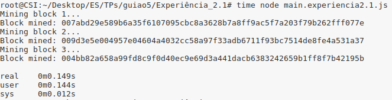
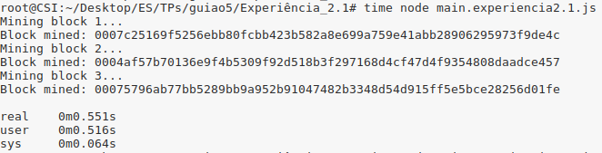
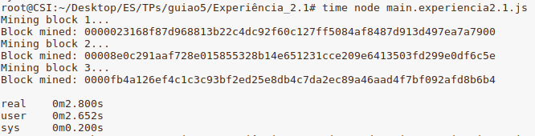
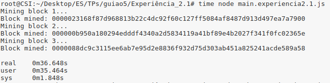

## Resolução da pergunta 2

### Alínea 2.1
Com o objetivo de explorar o funcionamento do *Proof of Work Consensus Model*, testamos a inserção de 3 blocos usando como *puzzle* o requisito do tamanho máximo para o *hash digest* do cabeçalho do bloco ser menor que um determinado valor. Por outras palavras, o nível de dificuldade do *puzzle* representa a quantidade de mínima de zeros que devem aparecer na hash antes de qualquer outro valor diferente de zero. De seguida são apresentados os resultados de adicionar blocos com dificuldades "2", "3", "4" e "5":

##### Dificuldade 1

##### Dificuldade 2

##### Dificuldade 3

##### Dificuldade 4

Como podemos observar, o programa demorou:
- 00.149 segundos para o nível de dificuldade 2;
- 00.551 segundos para o nível de dificuldade 3;
- 02.800 segundos para o nível de dificuldade 4;
- 36.648 segundos para o nível de dificuldade 5.

Assim sendo, é possível inferir que o tempo médio para a inserção de blocos aumenta exponêncialmente à medida que aumentamos o nível de dificuldade. De notar que quanto mais zeros forem necessários, menos *nonces* darão o resultado pretendido. Como a única solução para resolver este problema será testar vários *nonces* até obter um que satisfaça os requisitos do tamanho do *hash digest*, ou seja, executar várias funções de hash variando o *nonce*, quanto menos *nonces* satisfizerem os requisitos, mais difícil será encontrar um *nonce* válido. É importante mencionar que no caso acima apresentado, encontrar a solução depende apenas de probabilidades e que nem sempre o nodo com mais poder computacional é aquele que resolve o puzzle primeiro.

### Alínea 2.2
