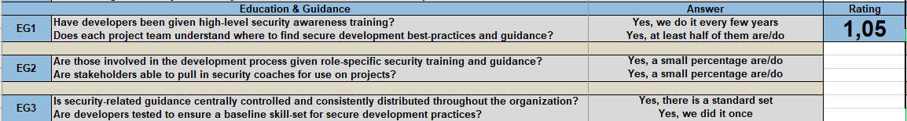
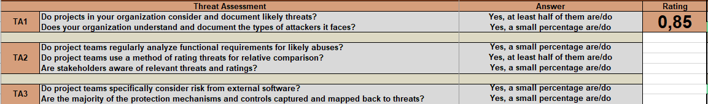

## Resolução da pergunta 3

### Alínea 1
Para responder a esta alínea, o grupo selecionou as práticas *Education & Guidance*, *Threat Assessment* e *Implementation Review*. Após preencher os campos afetos a cada uma destas práticas, na página *interview* do ficheiro excel fornecido, os níveis de maturidade obtidos foram os seguintes:
- **Education & Guidance:** Aproximadamente nível 1 de maturidade
  
- **Threat Assessment:** Aproximadamente nível 1 de maturidade
  
- **Implementation Review:** Aproximadamente nível 1 de maturidade
  

### Alínea 2
Tendo em conta que se trata de um processo de 1 ano, os níveis de maturidade pretendidos para cada uma das práticas identificadas na pergunta anterior ao fim de um ano são os seguintes:
- **Education & Guidance:** Aproximadamente nível 2 de maturidade
  
- **Threat Assessment:** Aproximadamente nível 2 de maturidade
  
- **Implementation Review:** Aproximadamente nível 2 de maturidade
  
  
  
### Alínea 3
O plano desenvolvido para atingir o nível de maturidade apresentado na alínea anterior encontra-se no separador "**Roadmap**" do ficheiro excel [SAMM_Assessment_Toolbox_v1.5_Grupo11.xlsx](SAMM_Assessment_Toolbox_v1.5_Grupo11.xlsx). Este plano encontra-se dividido em 4 fases, cada uma de aproximadamente 3 meses, totalizando assim a duração de 1 ano. É importante referir que não é possível, no prazo de um ano, cumprir alguns dos parâmetros presentes no **SAMM** pelo que o nível de maturidade projetado ao fim desse ano ainda está longe do objetivo final da organização. Assim que este plano for concluído será necessário projetar um novo plano.
