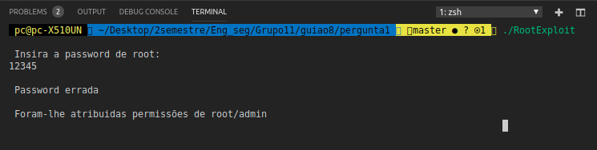
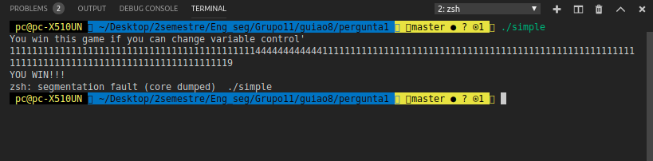

### RootExploit.c

Para a realização desta pergunta analisamos o código presente no RootExploit.c e reparamos imediatamente que faz uso de uma função considerada bastante perigosa, o *gets*, que não valida o tamanho do input introduzido. Como o array buff alocou 4 bytes de memória qualquer input que ultrapasse esse valor reescreve a variável *pass*, concedendo-nos *permissão de admin*

### 0-simple.c

Para este caso o método de exploração da falha é semelhante ao anterior, visto ambos utilizarem o *gets*. A diferença é que neste caso o array alocou 64 bytes, logo precisamos de introduzir no input mais de 64 caracteres de maneira a obter as permissões de admin

