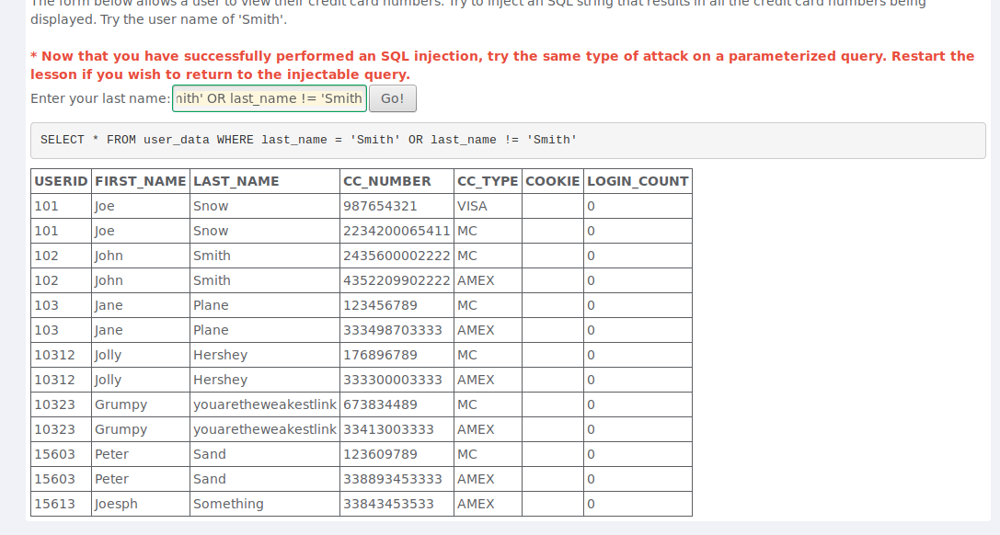
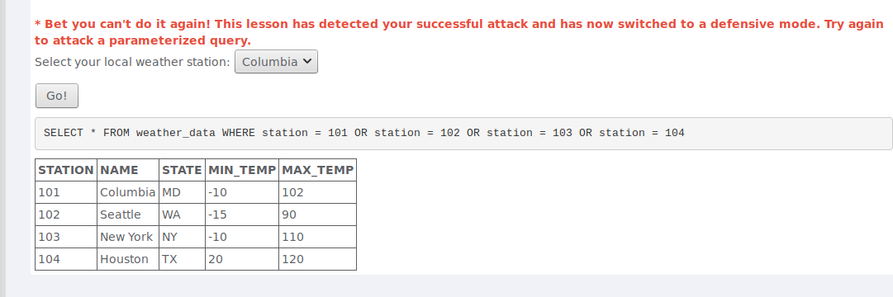
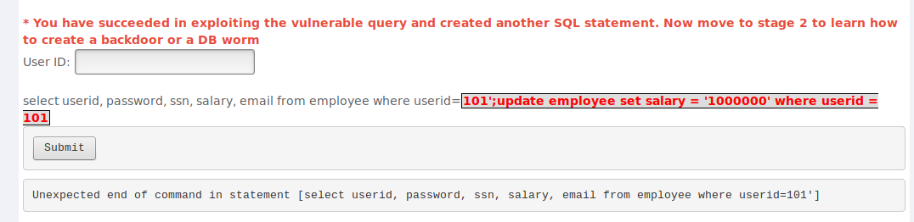

### Pergunta 1.1

Nesta pergunta era-nos pedido para obter toda a informação relativa a cartôes de crédito através de uma SQL Injection. Era-nos apresentado um campo de input onde poderiamos procurar pelo último nome de pessoas e obter a sua informação. Bastava colocar a String "Smith' OR last_name != 'Smith". Desta forma obtíamos uma tautologia e todos os cartôes eram expostos.

### Pergunta 1.2

Nesta alínea era-nos pedido que obtivéssemos todas as temperaturas de todas as cidades disponíveis. Aqui não conseguíamos mudar o input diretamente, por isso tivemos que usar a ferramenta de inspeção do HTML da página para o mudar. Depois de encontrar o HTML correspondente às escolhas mudamos os seus valores para "101 OR station = 102 OR station = 102 OR station = 103 OR station = 104". Assim quando esta opção era escolhida eram devolvidas todas as temperaturas lidas por todas as estações.

### Pergunta 1.3

Nesta alínea era-nos pedido que aumentássemos o salário do funcionário com ID 101 através de múltiplas execuções de código SQL. Sabendo que um comando SQL acaba com ";" apenas precisavamos de "acabar" o comando já começado pelo website de forma válida, fechar as "'" e terminar o comando com ";". A partir daqui poderíamos escrever o nosso comando, tendo o cuidado que o programa do website iria colocar "';" no fim. para tal usamos "101';update employee set salary = '1000000' where userid = 101"

