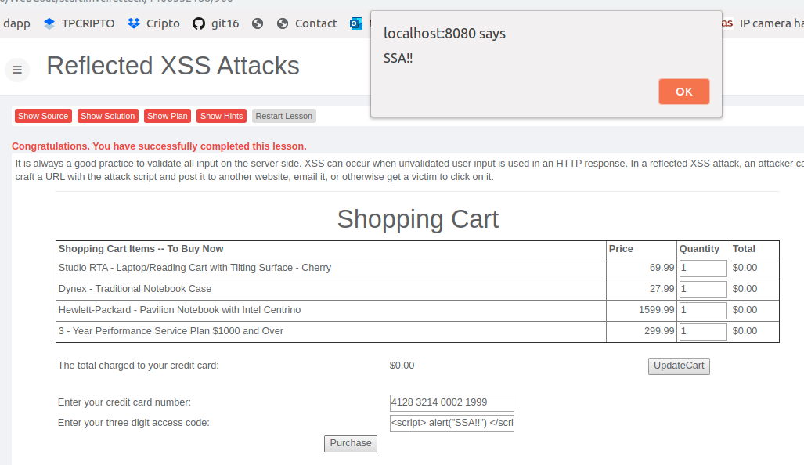

## Resolução da pergunta 2

### Pergunta 2.1
Podemos tentar diferentes combinações de inputs, com  diferentes tipos de caracteres e verificar os tipos de validações estao a ser feitas através das respostas obtidas a esses mesmos inputs.

### Pergunta 2.2
Sem resposta

### Pergunta 2.3
Podemos verificar o efeito do XSS reflected ao introduzir o input ** no campo *Enter your three digit access code:*. Como podemos ver pela imagem o input foi interpretado como código *javascript* e obtivemos a janela do *alert* no browser.

