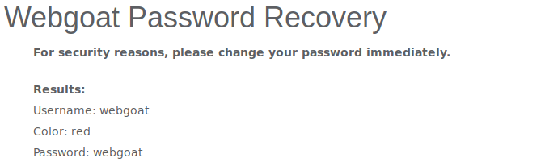
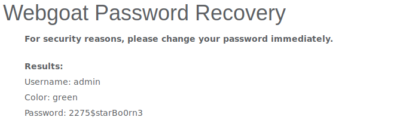

## Resolução da pergunta 3

### Alínea 1

Nesta alínea podemos verificar a facilidade com que é possível recuperar a *password* de uma conta que não nos pertence. Neste caso, para o utilizador **webgoat** recuperar a sua *password* apenas teria de responder corretamente à pergunta sobre qual a sua cor preferida.  Como dita a intuição, esta pergunta é muito facilmente respondida na maioria dos casos. Neste caso, a resposta correta é "red".

### Alínea 2

Num sistema existem vários utilizadores, entre os quais as pessoas que os utilizam, uma conta para ser usada por qualquer pessoa (por exemplo a de convidado ou a de acesso público aos funcionarios no caso de uma empresa) e ainda a conta do **admin**. Decidimos atacar o utilizador **admin** visto ser aquele que mais vantagens fornece em caso de ataque bem sucedido. 

### Alínea 3

Para obter a *password* do utilizador **admin** procedemos à recuperação da *password* visto apenas ser necessário responder corretamente à pergunta de qual a sua cor preferida. Na ausência de um método melhor, decidimos tentar responder a esta questão por força bruta. A ordem de tentativas foi {"red", "blue", "yellow", "green"} sendo esta última a resposta correta à pergunta de recuperação da *password*. Como podemos ver, adquirimos muito facilmente, com apenas 4 tentativas, a *password* do utilizador **admin** e consequentemente o acesso aos vários privilégios que este utilizador possui no sistema.

